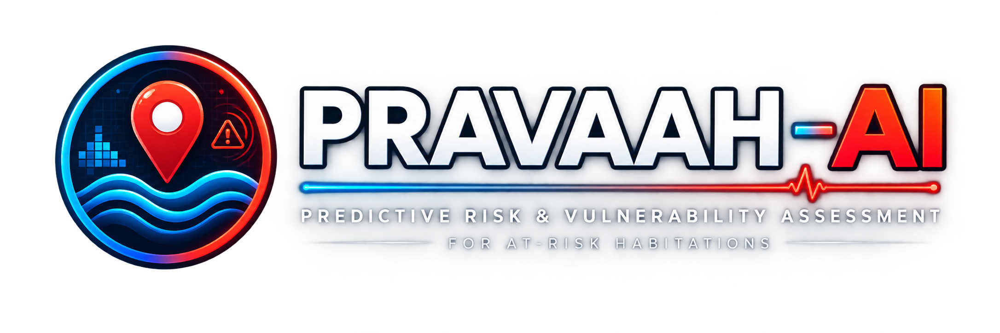

<div align="center">
  
</div>

# PRAVAAH-AI

## Predictive Risk & Vulnerability Assessment for At-Risk Habitations

[](https://github.com/KunalMK25/pravaah/actions/workflows/test.yml)


**PRAVAAH-AI** is an AI-powered geospatial decision-support system that identifies hazard-based red zones, evaluates vulnerable habitations, assesses exposure and carrying-capacity stress, and prioritises intervention or relocation using explainable spatial intelligence.

The system answers a single operational question:

> **"Which vulnerable habitations need attention, and why?"**

---

## Problem

Communities in flood-prone areas face a recurring challenge: hazard maps exist, but they do not answer which specific settlements are at risk, how many people are exposed, whether the area has the capacity to absorb displaced residents, or which habitations require immediate relocation rather than routine monitoring.

PRAVAAH-AI bridges that gap by layering habitation intelligence on top of a geospatial hazard foundation, producing ranked, explainable relocation priorities for every identified settlement in the study area.

---

## Solution

PRAVAAH-AI builds upon a geospatial risk-assessment foundation and extends it with habitation-level exposure, vulnerability, carrying-capacity, relocation intelligence, live weather integration, short-term forecasting, historical validation, and bounded agentic decision support.

```
Environmental / Geospatial Data
        ↓
Hazard Analysis Engine (ML + GIS)
  Grid · Features · WSI + Ensemble RF · Risk Score · RED/YELLOW/GREEN Zones
        ↓
Habitation Intelligence Layer
  Settlement Ingestion (OSM)
        ↓
  Exposure · Vulnerability · Carrying Capacity · Relocation Priority
        ↓
Dynamic Intelligence
  Live Weather → Dynamic Adjustment → 24–72h Forecast
        ↓
  Historical Flood Validation (independent metrics)
        ↓
  What-If Scenario Simulation
        ↓
  SHAP ML Explainability
        ↓
Agentic Decision Support (9 bounded agents)
        ↓
Explainable Recommendations → Authority Dashboard → PDF Report
```

---

## Key Capabilities

| Capability | Description |
|------------|-------------|
| **Hazard mapping** | Grid-based susceptibility (WSI + Random Forest + Ensemble, 10 geospatial factors) |
| **RED/YELLOW/GREEN zones** | Operational spatial zones derived from ML output via 8-neighbour adjacency |
| **Settlement ingestion** | Live OpenStreetMap habitation nodes (city/town/village/hamlet/suburb) |
| **Exposure analysis** | Each settlement overlaid against the hazard grid; population from OSM tags |
| **Vulnerability scoring** | Transparent 7-component weighted index (all weights declared) |
| **Carrying capacity** | Safe area, road accessibility, healthcare proximity (OSM-sourced) |
| **Relocation priority** | Formula-driven priority with 4 documented guardrails |
| **Relocation candidates** | GREEN-zone discovery and scoring for HIGH/CRITICAL habitations |
| **Live weather** | OpenWeatherMap integration with dynamic risk adjustment |
| **Short-term forecast** | 24/48/72h rainfall-adjusted risk projection (ESTIMATE) |
| **Historical validation** | Independent P/R/F1/IoU against documented flood extents |
| **What-if scenarios** | Rainfall / drainage / population parameter simulation (SIMULATION) |
| **SHAP explainability** | TreeSHAP per-cell and global importance for the ML hazard model |
| **Agentic AI** | 9 bounded agents: Hazard, Exposure, Vulnerability, Capacity, Relocation, Weather, Forecast, Scenario, Validation |
| **Authority dashboard** | 12-tab Streamlit DSS for decision-makers |
| **PDF report** | Full risk assessment with habitation rankings and relocation priorities |

---

## Architecture

### Hazard Analysis

| Dataset | Source | Provenance |
|---------|--------|------------|
| Elevation | NASA SRTM GeoTIFF + OpenTopoData API | `real` / `api` / `synthetic` |
| Water bodies | OSM Overpass API | `osm_overpass` / `osm_cache` |
| Rainfall | Synthetic (GPM-structured) | `synthetic` |
| Habitations | OSM Overpass API (place= nodes) | `osm_overpass` / `osm_cache` / `fallback` |
| Roads / Healthcare | OSM Overpass API | `osm_overpass` |
| Weather | OpenWeatherMap | `LIVE` / `CACHED` / `UNAVAILABLE` |
| Population | OSM `population` tag only | `osm_tag` / `UNKNOWN` |

### Spatial Zone System

| Zone | Definition | Source |
|------|-----------|--------|
| 🟥 **RED** | Primary hazard zone | ML `risk_class = "High"` |
| 🟨 **YELLOW** | Secondary attention zone | 8-neighbour adjacent to RED, or Medium class |
| 🟩 **GREEN** | Lower-risk / potential safe area | Not RED, YELLOW, or Water |
| 🔵 **WATER** | Permanent water body | `risk_class = "Water"` |

### Relocation Priority Formula

```
relocation_score =
    0.35 × hazard_score / 100
  + 0.30 × vulnerability_score
  + 0.20 × (1 − capacity_score)
  + 0.15 × exposure_component
```

Guardrails: capacity CRITICAL +0.10 bonus · coastal → HIGH escalates to CRITICAL · unknown population cap at HIGH.

### Agentic Architecture

9 bounded agents, each consuming structured PRAVAAH-AI pipeline outputs:

| Agent | Responsibility | Invoked for |
|-------|---------------|------------|
| HazardAnalyst | Interprets hazard metrics and zone | All priorities |
| ExposureAnalyst | Population exposure with honest provenance | MEDIUM+ |
| VulnerabilityAnalyst | Component breakdown | HIGH+ |
| CapacityAnalyst | Capacity constraints | HIGH+ |
| RelocationPlanner | Synthesises evidence, recommends candidates | HIGH+ |
| WeatherAnalyst | Live rainfall and dynamic adjustment | When weather available |
| ForecastAnalyst | 24–72h risk projections (ESTIMATE label) | When forecast available |
| ScenarioAnalyst | What-if deltas (SIMULATION label) | When scenario run |
| ValidationAnalyst | Historical validation metrics | When validation run |

LLM invoked for HIGH/CRITICAL only. Deterministic fallback always active. Set `PRAVAAH_LLM_PROVIDER` + key to enable AI explanations.

---

## Scientific Honesty

PRAVAAH-AI is explicit about data quality at every stage:

- Population is **UNKNOWN** when absent from OSM — never fabricated
- ML metrics are cross-validation on WSI pseudo-labels — **not validated against real flood events** (historical validation is independent)
- Forecasts are always labelled **ESTIMATE** — not deterministic predictions
- Scenarios are always labelled **SIMULATION** — baseline is never overwritten
- Relocation candidates are **decision-support recommendations** — not officially designated sites
- GREEN zones are **lower-risk areas** — not guaranteed safe
- Shelter capacity is **unavailable** — no curated national dataset integrated
- Road/healthcare distances are **straight-line** (Euclidean), not routed

---

## Setup & Running

### Install dependencies

```bash
pip install -r requirements.txt
```

### Run locally

```bash
streamlit run app.py
```

### Configure environment (optional)

```bash
cp .env.example .env
# Edit .env — add OPENWEATHER_API_KEY, PRAVAAH_LLM_PROVIDER, etc.
```

### Run tests

```bash
python -m pytest tests/ -q --no-cov
# Expected: 509 passed, 0 failed
```

---

## Deployment

### Streamlit Community Cloud (recommended)

1. Push to `https://github.com/KunalMK25/pravaah`
2. Go to [share.streamlit.io](https://share.streamlit.io) → New app
3. Repository: `KunalMK25/pravaah` · Branch: `main` · File: `app.py`
4. Add secrets (Settings → Secrets):
   ```toml
   OPENWEATHER_API_KEY = "your_key"          # optional
   PRAVAAH_LLM_PROVIDER = "openai"           # optional
   OPENAI_API_KEY = "sk-..."                 # if LLM enabled
   ```
5. Deploy — `packages.txt` and `requirements.txt` are read automatically

See [DEPLOYMENT.md](DEPLOYMENT.md) for complete deployment instructions.

### Environment Variables

| Variable | Required | Purpose |
|----------|----------|---------|
| `OPENWEATHER_API_KEY` | Optional | Live weather data |
| `PRAVAAH_LLM_PROVIDER` | Optional | `openai` / `anthropic` / `none` |
| `OPENAI_API_KEY` | If LLM=openai | OpenAI API key |
| `ANTHROPIC_API_KEY` | If LLM=anthropic | Anthropic API key |

---

## Outputs

| File | Description |
|------|-------------|
| `PRAVAAH-AI_Hazard_Grid.csv` | Per-cell hazard scores and features |
| `PRAVAAH-AI_Hazard_Map.geojson` | Full hazard grid as GeoJSON |
| `PRAVAAH-AI_Relocation_Priority.csv` | Ranked habitation assessment |
| `PRAVAAH-AI_Risk_Assessment.pdf` | Full structured report |

---

## Demo Flow (3–5 minutes)

1. Open app → select **Gottigere, Bangalore** → click **Run Analysis**
2. **Hazard Map** tab → RED/YELLOW/GREEN zones + habitation markers
3. **Spatial Zones** tab → zone distribution + candidate areas
4. **Habitations** tab → select a CRITICAL habitation → full breakdown
5. **Relocation Priority** tab → ranked table + priority chart
6. **Weather** tab → live conditions + dynamic adjustment
7. **Forecast** tab → 24/48/72h projected zones
8. **Scenarios** tab → run "+30% Rainfall" → compare with baseline
9. **AI Support** tab → agent evidence + relocation candidates
10. **Explainability** tab → SHAP explanation for a high-risk cell
11. **Data & Export** → download CSV + generate PDF report

---

## Known Limitations

1. Drainage capacity is synthetic — real municipal drain data would improve accuracy
2. Population from OSM is sparse for many Indian settlements — many show UNKNOWN
3. Road and healthcare distances are straight-line only — routing would be more accurate
4. Forecast is a rainfall-adjusted estimate — not a physically-based hydrological model
5. Historical validation uses coarse approximate polygons (~1 km accuracy)
6. Habitation completeness depends on OSM mapping quality for the study area
7. Sentinel-1 satellite integration: architecture hook exists, not yet automated

---

## Future Scope

- Authoritative population raster integration (WorldPop / Census ward data)
- Road routing for realistic evacuation time estimates
- Sentinel-1 flood extent comparison layer
- Full hydrological forecast model (once temporal training data available)
- What-if scenarios integrated into agent decision workflow

---

## Project Structure

```
pravaah/
├── app.py                              # Streamlit entry point (12-tab DSS)
├── requirements.txt                    # Python dependencies
├── packages.txt                        # System packages for cloud deployment
├── .env.example                        # Environment variable template
├── DEPLOYMENT.md                       # Deployment guide
├── assets/
│   └── pravaah_ai_logo.svg             # Product logo
├── flood_risk_zonation/                # Core analysis package
│   ├── pipeline.py                     # Phase 1 hazard engine
│   ├── sih_pipeline.py                 # Phase 2+3 habitation intelligence
│   ├── models.py                       # All typed dataclasses
│   ├── config.py                       # BoundingBox, PipelineConfig
│   ├── health.py                       # Application health check
│   ├── habitation/                     # OSM settlement ingestion
│   ├── exposure/                       # Spatial exposure analysis
│   ├── vulnerability/                  # Weighted vulnerability scorer
│   ├── capacity/                       # Carrying capacity assessment
│   ├── relocation/                     # Priority + candidate discovery
│   ├── spatial_zones/                  # RED/YELLOW/GREEN classifier
│   ├── weather/                        # Live weather client
│   ├── forecast/                       # 24–72h risk projection
│   ├── validation/                     # Historical flood validation
│   ├── scenarios/                      # What-if simulation engine
│   ├── explainability/                 # SHAP ML explainability
│   ├── agents/                         # Agentic decision support
│   ├── features/                       # Geospatial feature extraction
│   ├── scoring/                        # Susceptibility models
│   └── visualization/                  # Map, PDF, export
└── tests/
    ├── unit/                           # 40+ unit test files
    ├── integration/                    # Integration tests
    └── property/                       # Hypothesis property tests
```

---

*PRAVAAH-AI — Predictive Risk & Vulnerability Assessment for At-Risk Habitations*
